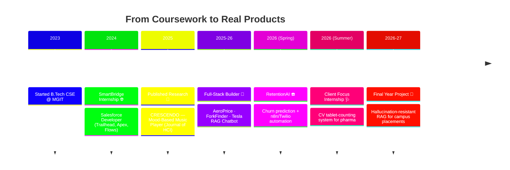

<p align="center">
  
</p>

<h3 align="center">🎓 CSE Student @ MGIT Hyderabad &nbsp;·&nbsp; 🤖 Computer Vision &nbsp;·&nbsp; 🧠 RAG & LLMs &nbsp;·&nbsp; 💻 Full Stack</h3>

<p align="center">
  <a href="https://www.linkedin.com/in/charvigosala/"></a>
  <a href="https://linktr.ee/charvigosala"></a>
  <a href="mailto:gosalacharvi@gmail.com"></a>
  <a href="https://github.com/Charvigosala"></a>
</p>

<p align="center">
  
</p>

<p align="center">
  
  
  
</p>

---

## 🌸 About Me

```yaml
name: Gosala Venkata Charvi
role: B.Tech Computer Science Student
college: Mahatma Gandhi Institute of Technology (MGIT), Hyderabad
duration: 2023 – 2027
gpa: 9.07 / 10
roles: [Class Representative, Placement Coordinator, Convener - QUBIT Tech Fest]
currently_building: "Hallucination-resistant RAG chatbot for campus placements"
currently_learning: [SQL, LoRA/QLoRA fine-tuning, System Design]
goal: "SDE / AI-ML role at a product-driven company"
```

<br>

## 🧭 My Journey So Far



<br>

## 🛠️ Tech Stack

<table>
<tr>
<td valign="top" width="50%">

**Languages**
<br>


**Frontend**
<br>


**Backend**
<br>


</td>
<td valign="top" width="50%">

**AI / ML**
<br>


**Automation**
<br>


**Tools**
<br>


</td>
</tr>
</table>

<br>

## 📊 GitHub Stats

<p align="center">
  
  
</p>

<p align="center">
  
</p>

<p align="center">
  
</p>

<br>

## 🚀 Featured Projects

<table>
<tr><td width="100%">

### 🩺 Pharma Tablet Counting System
CCTV-based automatic tablet counting for a healthcare/pharma client, built during my AI/ML internship at Client Focus.
- **Roboflow** polygon annotation across ~60 drug types, ~500 training images
- Trained an **object detection model** to identify drugs by name and evaluate detection accuracy

`Computer Vision` `Roboflow` `Object Detection`

</td></tr>
<tr><td width="100%">

### ☎️ RetentionAI — Telecom Churn Prediction
Self-initiated churn prediction system with automated customer outreach.
- **Logistic regression model** scoring customers by churn risk
- Routed via **n8n** Switch Channel node to **Twilio** (call/WhatsApp/SMS)

[🔗 Repo](https://github.com/Charvigosala/RetentionAI) · `Python` `n8n` `Twilio` `Logistic Regression`

</td></tr>
<tr><td width="100%">

### 🤖 Tesla Financial RAG Chatbot
Retrieval-augmented chatbot answering questions over Tesla's financial documents.

[🔗 Repo](https://github.com/Charvigosala/tesla-financial-rag-chatbot) · `RAG` `LangChain` `LLMs`

</td></tr>
<tr><td width="100%">

### 💬 Sentiment Analysis Automation
Automated pipeline for sentiment classification and analysis workflows.

[🔗 Repo](https://github.com/Charvigosala/sentiment-analysis-automation) · `Python` `NLP` `Automation`

</td></tr>
<tr><td width="100%">

### 🦙 Ollama AI Agent (n8n)
AI agent built with local Ollama models, orchestrated through n8n workflows.

[🔗 Repo](https://github.com/Charvigosala/ollama-ai-agent-n8n) · `Ollama` `n8n` `LLMs`

</td></tr>
<tr><td width="100%">

### ✈️ AeroPrice — Flight Fare Predictor
ML-powered fare estimation app based on airline, route, stops, and travel date.

[🔗 Repo](https://github.com/Charvigosala/Aeroprice) · `React` `FastAPI` `scikit-learn`

</td></tr>
<tr><td width="100%">

### 🍴 ForkFinder — Restaurant Discovery Platform
Full-stack MERN app with real-time location detection and an interactive Leaflet map, OpenStreetMap data, and personalized recommendations.

[🔗 Repo](https://github.com/Charvigosala/Forkfinder) · `MongoDB` `Express` `React` `Node.js` `Leaflet`

</td></tr>
<tr><td width="100%">

### 🎵 CRESCENDO — Mood-Based Music Player
Published research: *Journal of Research and Reviews in Human Computer Interaction* (Vol. 1, Issue 3, 2025). Companion project simulates enterprise support workflows — OTP recovery, email notifications, activity tracking.

[🔗 Repo](https://github.com/Charvigosala/user-support-portal-crescendo-) · `Research` `HTML/CSS/JS` `HCI`

</td></tr>
<tr><td width="100%">

### 🎫 Enterprise Helpdesk System
Internal IT support and ticket management system.

[🔗 Repo](https://github.com/Charvigosala/enterprise-helpdesk-system) · `PHP`

</td></tr>
<tr><td width="100%">

### 🎲 Share-a-Fact
Fun fact-sharing web app.

[🔗 Repo](https://github.com/Charvigosala/share-a-fact) · `JavaScript`

</td></tr>
<tr><td width="100%">

### 📝 Code Snippets
Collection of reusable Python code snippets and utilities.

[🔗 Repo](https://github.com/Charvigosala/code-snippets) · `Python`

</td></tr>
</table>

<p align="center">
  <a href="https://github.com/Charvigosala?tab=repositories"></a>
</p>

<br>

## 💼 Experience

**🩺 AI/ML Intern** — *Client Focus Private Limited, May–Jul 2026*
Built a CCTV-based computer vision system to auto-count pharmaceutical tablets for a healthcare client, using Roboflow-annotated data across 60+ drug types.

**⚡ Salesforce Developer Intern** — *SmartBridge, May–Jul 2025*
Hands-on Salesforce development — Apex, Flows, and platform customization.

<br>

## 🏵️ Leadership & Achievements

- 🏆 **Placement Coordinator** — supporting peer placement efforts at MGIT
- 📋 **Class Representative**
- 🎪 **Convener, QUBIT** — MGIT's technical fest
- 💻 500+ DSA problems solved
- 🏅 Cognizant Technoverse 2026 — Prefinalist
- 📄 Published co-author — CRESCENDO (Journal of HCI, 2025)

<br>

## 📜 Certifications

<p>
  
</p>

<br>

## 🗺️ Roadmap

```text
2023 ── Started B.Tech CSE @ MGIT Hyderabad
2024 ── Salesforce Internship @ SmartBridge
2025 ── Published Research · Full-Stack Projects
2026 ── AI/ML Internship · RAG Systems · Placements
2027 ── Software Engineer, shipping AI-driven products 🚀
```

<br>

<p align="center"><i>"Consistency compounds — one query, one commit, one model at a time."</i></p>

## 🌸 Connect with Me

<p align="center">
  <a href="https://www.linkedin.com/in/charvigosala/"></a>
  <a href="https://linktr.ee/charvigosala"></a>
  <a href="mailto:gosalacharvi@gmail.com"></a>
</p>

<p align="center">
  
</p>
